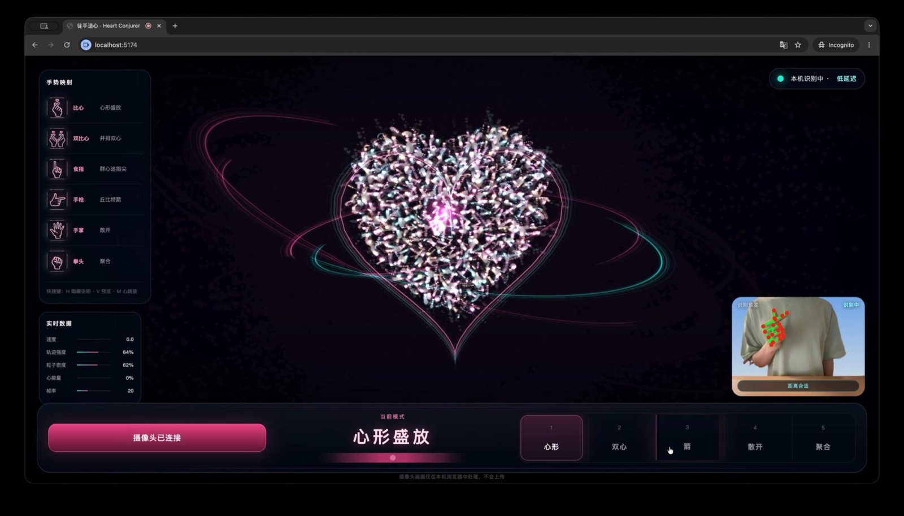

# 徒手造心 · Heart Conjurer



在线展示：https://liyincode.github.io/heart-conjurer/

摄像头识别手势，挥手造出**成群发光的爱心**追着指尖飞；聚散变阵成 💗心形 / 💞双心 / 🏹丘比特之箭 / 🌌散开星河。霓虹流光、粒子拖尾、心跳光晕、柔光的梦幻浪漫画风。

纯前端静态页面，零构建。手势识别用 **MediaPipe Tasks `HandLandmarker`**（Google 开源库，模型文件本地加载，未造轮子）。

## 运行

摄像头需要**安全上下文**（`https://` 或 `http://localhost`），所以不能直接双击打开 `index.html`，要起一个本地服务：

```bash
cd heart-conjurer
python3 -m http.server 5173
# 浏览器打开 http://localhost:5173 ，点「开启摄像头」并允许授权
```

> 任意静态服务器都行，例如 `npx serve -l 5173`。
> 首次加载仍需从 CDN 拉取 MediaPipe JS/WASM 运行库；手势模型已放在项目本地。

## 玩法

| 手势 | 效果 |
| --- | --- |
| 🤏 单手手指比心 | 心形盛放 |
| 🤏🤏 双手同时手指比心 | 并排双心 |
| ☝️ 食指 | 群心追着指尖飞（挥得越快越汹涌） |
| 🔫 手枪手势（拇指明显远离食指） | 丘比特之箭（顺着手指朝向） |
| 🖐 手掌打开 | 散开成星河 |
| ✊ 拳头 | 万心聚合 |

**快捷键**：`H` 隐藏说明 · `V` 摄像头预览 · `M` 心跳音效

## 摄像头

没有摄像头 / 拒绝授权 / 无网时，会停留在待机舞台并提示摄像头问题；主要体验依赖摄像头识别手势。

## 隐私

摄像头画面只在本机浏览器内处理，不上传任何服务器。

## 技术

- **手势**：`@mediapipe/tasks-vision` HandLandmarker（21 关键点/手，最多双手，GPU 推理）
- **渲染**：Canvas2D 预渲染发光爱心精灵 + `lighter` 叠加混合；半透明覆盖实现拖尾余晖
- **阵型**：填充心形 / 双心 / 箭 / 对数螺旋星系的参数方程，粒子弹簧吸附目标点做聚散变换
- **氛围**：lub-dub 心跳曲线驱动光晕与缩放，多层径向柔光 + 暗角
